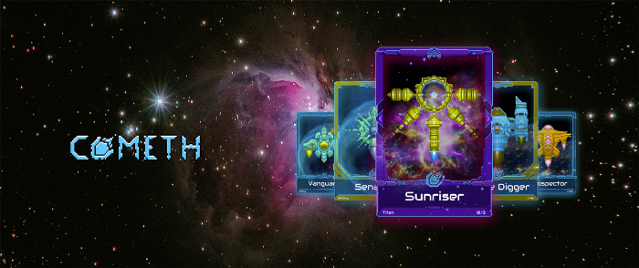
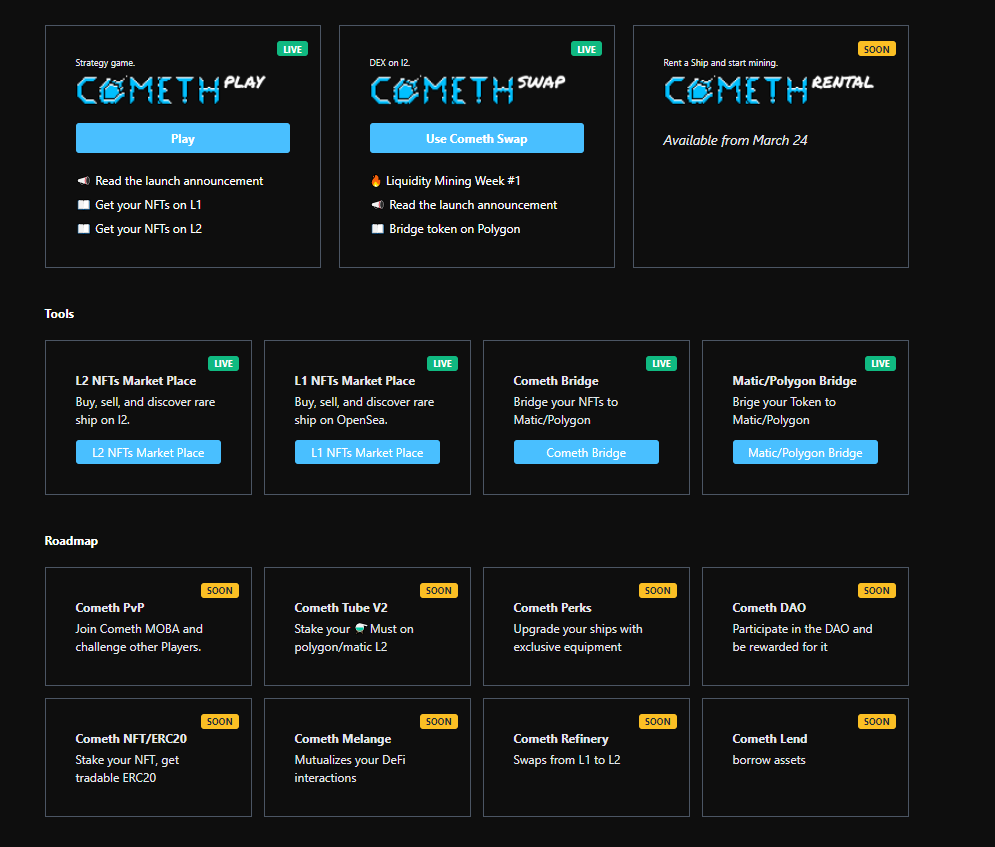
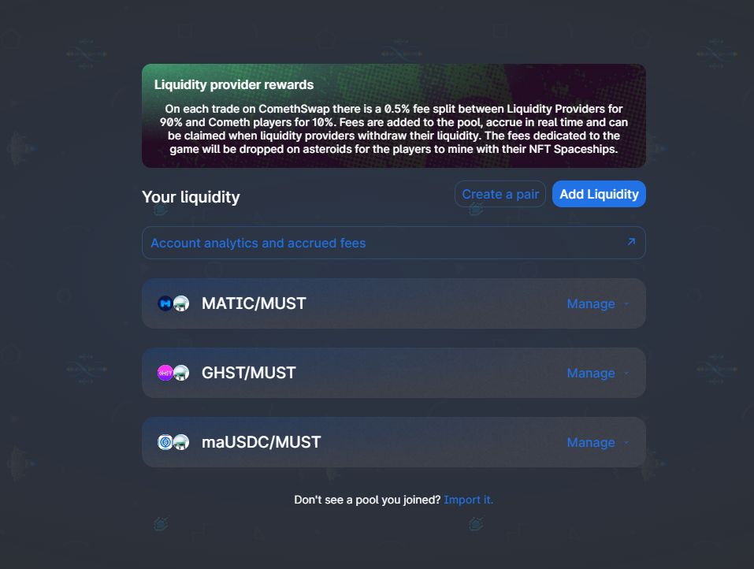
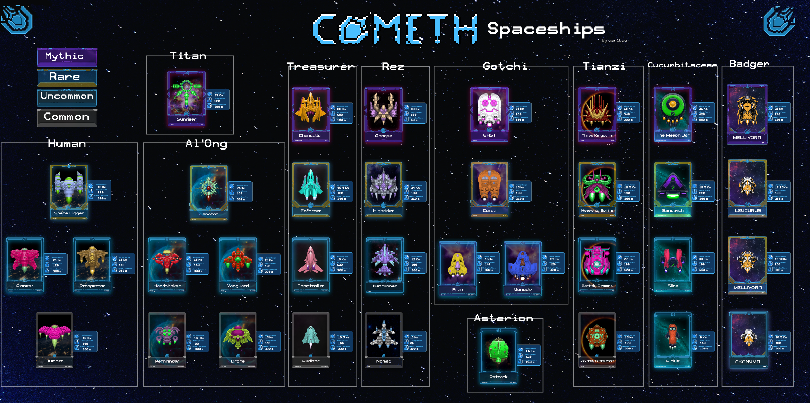

# Cometh.io

### **What is Cometh?** [**Cometh in french**](https://cometh.gitbook.io/comethfr/) ****

[Cometh](https://cometh.io/) is a groundbreaking and evolving strategy game set in a persistent and sustainable space-inspired metaverse powered by Ethereum's blockchain. 

**The Cometh game consists in players mining asteroids to get tokens as rewards.**

Cometh’s ecosystem leverages Ethereum-based DeFi \(Decentralized Finance\) in a fun and original way to enable players to collect, trade, and earn tokens from ERC-20 protocols, and also NFT’s unique to the Cometh Metaverse.   
  
On [app.cometh.io](https://app.cometh.io/) you can see applications and tools composing the Cometh Metaverse.

Cometh leverages ‘layer 2’ scaling solutions including both [Polygon](https://polygon.technology/) \(formerly Matic\) and \(soon\) Arbitrum’s Optimistic Rollups so that players can focus on the game instead of blockchain-related fees.

## 1. [How to play the game](game/how-to-play-cometh-1.md) 🕹

After you [Enter the game](game/enter-the-game.md), discover[ How to play](https://app.gitbook.com/@cometh/s/cometh/game/how-to-play-cometh-1) and mine your first comets ☄️

## 2. You've played. What's next?

Have you just mined a comet? Learn [What to do after mining](rewards/)

Want to learn how to leverage your earnings? Read more more about the [farm/earn token](https://app.gitbook.com/@cometh/s/cometh/staking-rewards) mechanics.

#### [ComethSwap](https://swap.cometh.io/#/swap) is the next step !

## 3. Use [ComethSwap](https://swap.cometh.io/#/swap) to leverage your rewards

Learn everything you need to know about [ComethSwap](comethswap-1/comethswap/) [**here**](https://app.gitbook.com/@cometh/s/cometh/comethswap)

## 4. Learn more about [Spaceships](https://app.gitbook.com/@cometh/s/cometh/spaceships/spaceships)

To play, you will need a spaceship NFT 🛸

> [How to get your own spaceship](spaceships/how-to-get-spaceships.md)?

Players can visit our shop on [Opensea](https://opensea.io/collection/cometh-spaceships/) and purchase NFTs for use in the game.   
The proceeds of the sales are used to create prizes for the players and distribute [MUST](comethswap-1/tokens/) ⚗️ as cashback.

**You can also rent spaceships directly on Layer2 via** [**ComethRental** ](https://rental.cometh.io/)**!** 

## 5. What is [MUST](comethswap-1/tokens/) **⚗️**

**MUST is the main currency of the Cometh ecosystem.**   
It is a \(ERC20\) token lying on the Ethereum blockchain.  
  
**Learn more about** [**Tokens**](comethswap-1/tokens/) **and** [**Hot to get MUST**](comethswap-1/tokens/how-to-get-must.md)  
  
****

## **6. join our Discord to get all the news !**   [**https://discord.com/invite/gAWTyctkze**](https://discord.com/invite/gAWTyctkze)\*\*\*\*

