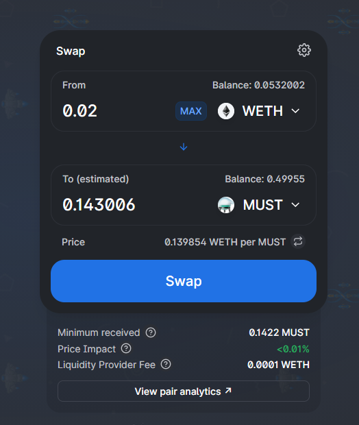

# How to get MUST

You can get MUST in multiple ways:

1. On Ethereum Mainnet \(L1\) via [Uniswap](https://info.uniswap.org/token/0X9C78EE466D6CB57A4D01FD887D2B5DFB2D46288F) or [Sushiswap](https://app.sushi.com/token/0X9C78EE466D6CB57A4D01FD887D2B5DFB2D46288F)
2. On [ComethSwap](https://swap.cometh.io/) \(L2\), after [moving your funds on L2](../comethswap/matic-bridge.md)

