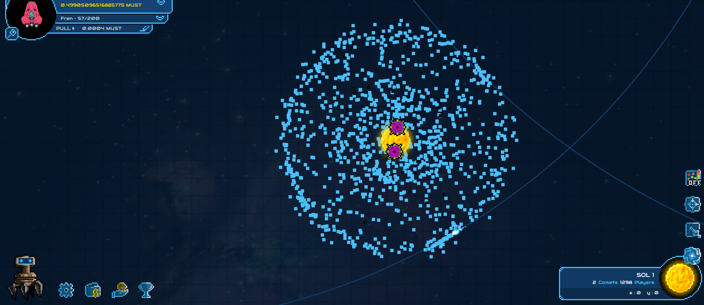
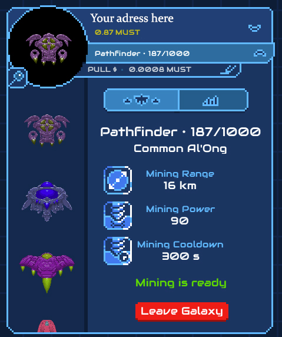
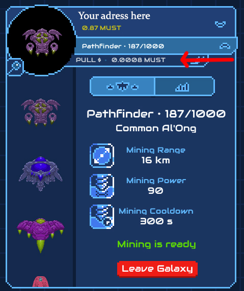
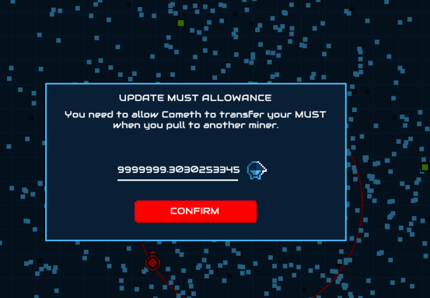
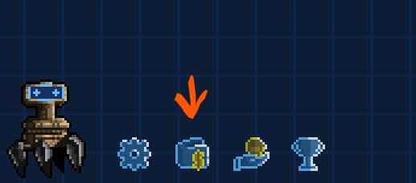
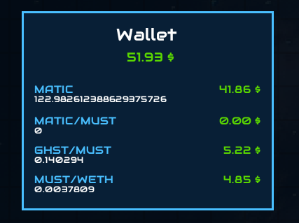
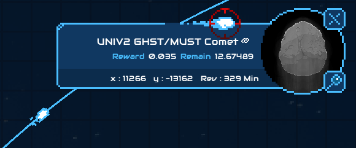
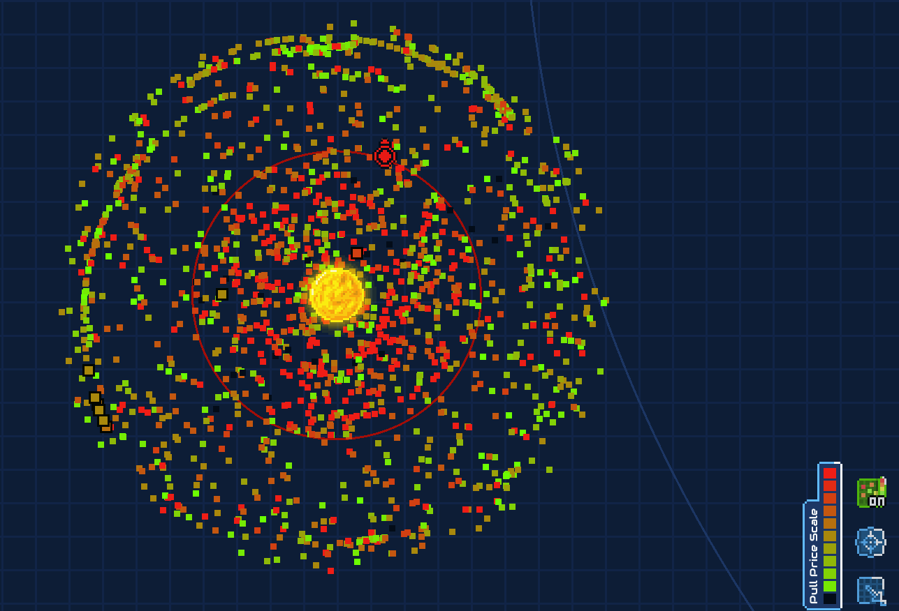

# How to play Cometh

Space Apes, here we are! You’re almost ready to mine juicy comets and earn valuable tokens 🛸.   
  
**The goal is to mine comets. You move by pulling towards other spaceships. You can only travel half the distance.**

In this guide, you’ll find few tips to easily navigate the galaxy and earn cosmic rewards.

> Make sure you've followed the steps of how to [Enter the Game](cometh-bridge.md)

First enjoy the view from your cockpit 😃: thousands of spaceships flying around the giant sun, an overview of your main details \(pulling price, balance, number of miners & comets and your wallet address\)

You can explore your fleet on the top left of the screen, and select the spaceship you want to navigate with:

On the bottom right, you’ll get a complete view of your spaceships, it will be very useful once we’ll introduce perks, aura…

Come back on the map and set up your pulling price \(this is the price other spaceships will have to pay to pull on you\).

> 0.0003 is the smallest value accepted  
> Cometh takes 5% fees on each pull for a minimum of 0.0003
>
> For example, if your pulling price is 0.006 $MUST, Cometh will take 0.0003 $MUST which correspond to 5%. You will receive 0.0057 $MUST

You will need to set up your $MUST allowance amount by clicking on the hand with a coin on the bottom left corner of your screen, and choose which amount you allow Cometh to transfer. 

> This is mandatory to pull on other ships and a requirement from the blockchain in Cometh's backend.  
> This is the maximum amount that you will be allowed to spend in-game. We'll never spend MUST in your behalf, you will.

To see you wallet content, you can click on this icon:

Zoom back if you don’t see any comet. Click on a comet to explore how juicy they are \(ie. what reward amounts and type of tokens they have\):

> On this particular comet you can mine some GHST/MUST LP tokens; "Reward 0.035" is what you will get for a [100% mining power ship](../spaceships/spaceship-characteristics.md), "Remain 12.67" is what's left to be mined in the comet before it disappears

Now let’s chase it!   
For that you will need to make a few moves and pull on other spaceships to reach the Graal.

Cometh's principle is to pull yourself \(your spaceships\) towards other players/spaceships to get as close to the Cometh as possible.

To do so, click on a dot \(dot = spaceship\), click on jump and validate the transaction in Metamask.  
You will get halfway to the dot. Each jump has a price: the "Pull price", determined by players.

Your spaceship has an aura around it determined by its [**Mining Area**](../spaceships/spaceship-characteristics.md)**.  
You need to position your spaceship so that the comet flies through your spaceship aura.**

You can activate and deactivate a tactical mode by clicking on the Bottom right corner button.   
It is a very important feature that displays pulling prices of surrounding ships.

> You can see some footages of an experienced player here : [https://www.youtube.com/watch?v=e6TzeU1AI7E](https://www.youtube.com/watch?v=e6TzeU1AI7E)

**Your training is complete, you are now able to safely pilot your spaceship and mine comets throughout the galaxy**👨‍🚀

### Want to know more about [Solar Systems](change-system-solars-todo.md) and how to navigate the Galaxy?

