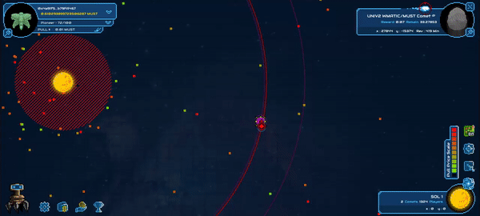
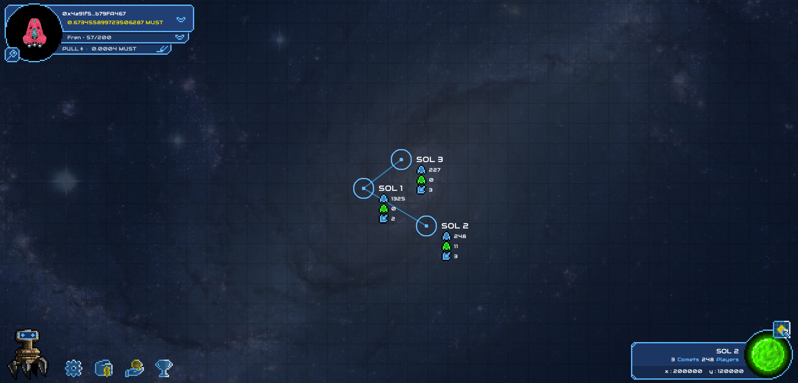
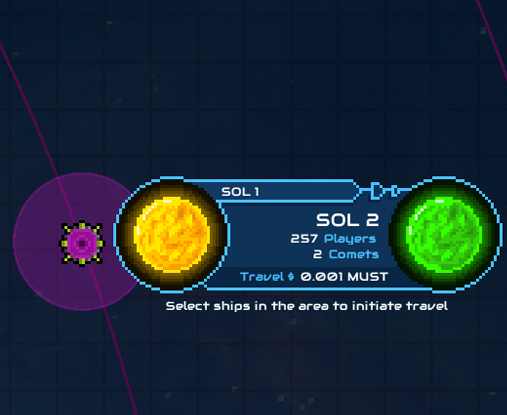

# Change Solar Systems

## The Cometh galaxy is wide, there are countless stars and many juicy comets to be mined. 

Move your ship to different solar systems for more opportunities to get rewards.

**Each solar system has its own comets.**

There is currently 3 solary systems, also called: SOL 1, SOL 2 and SOL3.

## How to travel to other solar systems 

In solar systems, you can find portals.

These portals will allow you to travel to other solar systems.

**Position your ship in the aura of the portal, a notification will appear allowing you to travel.**

> Portals are **faster than spaceships** so you can place your ship in the same orbit and just wait for the portal to reach you.

**Traveling have a cost.** You currently have to pay 0.001 MUST to the intergalactic toll company.

### At the moment, 3 solar systems are available in game.

To view all solar systems click on the Galaxy Map toggle button in the bottom right of your screen

For each solar system, you can see how many ships it contains, how many of your ships are in, and the number of comets.  

As initially explained in the [Whitepaper](https://www.cometh.io/cometh-white-paper.pdf), Cometh should have a maximum number of spaceships per solar system. Although no such limit is currently enforced and will be left to the MUST holder’s governance to decide, it was considered at a starting point to 1,000 both for balancing the difficulty of the game and for performance considerations.what 1770 Spaceship actively mining looks like.

3 portions of the galaxy can now be explored, they have differents comets  and population.

To reach a new Sol, you need to use the **Portals.**

#### **First find the portal corresponding to the Sol you want to reach.**

#### Then use the portal to travel to your new Sol.

To do so, you have to be on the path of the portal you want to use, and while having **your ship selected**, a notification will pop on the left of your screen to pay for the travel.  
after paying the 0.001 fees, you will travel to your new destination.

> Portals are **faster than spaceships** so you can place your ship in the same orbit and just wait for the portal to reach you.

