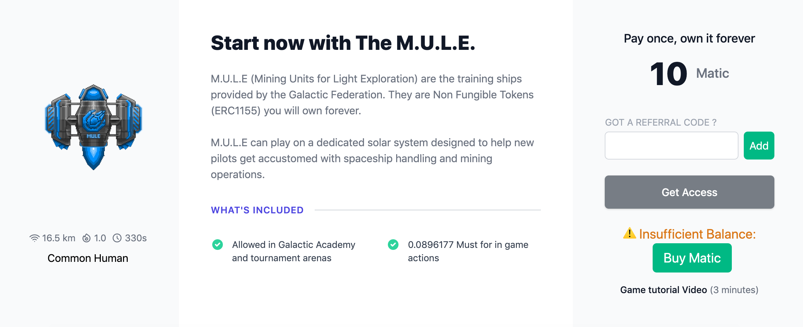
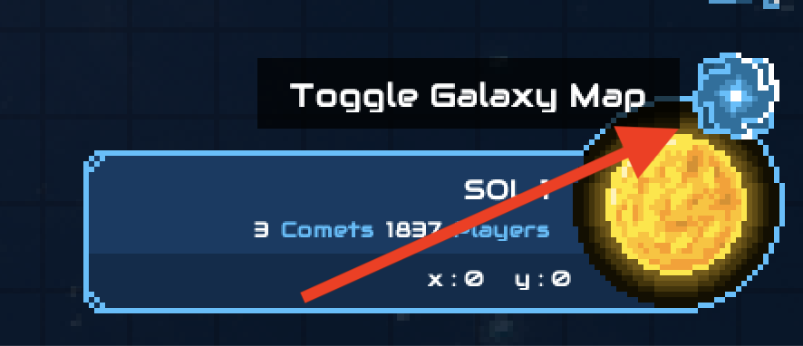
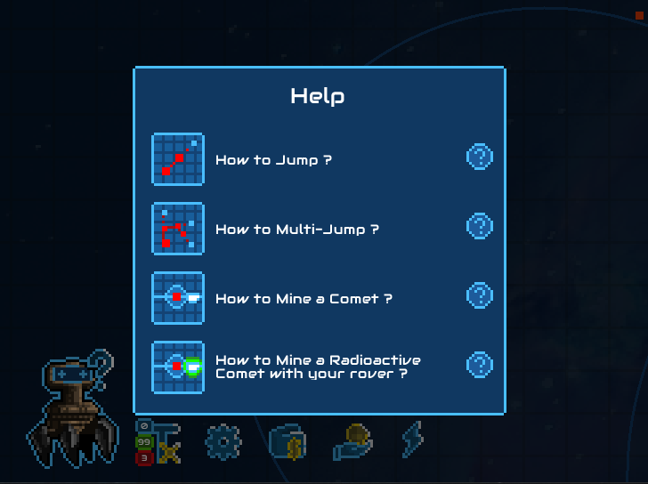
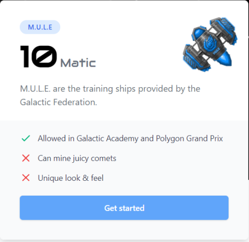
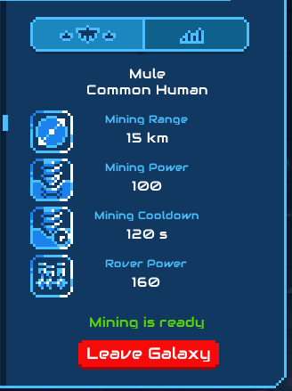

# How to join the Grand Prix

To play the Grand Prix you will need :  
  
- Metamask wallet \(or play with your email cf: [https://docs.cometh.io/play-the-game-without-metamask-wallet](https://docs.cometh.io/play-the-game-without-metamask-wallet)\),   
- M.U.L.E Spaceship,   
- Small amount of $MUST \(provided with the Mule\)

Heads to[https://game.cometh.io/shop/mule](https://game.cometh.io/shop/mule) to get your very own M.U.L.E

## What is a M.U.L.E?

.....

To join the Academy, You first need to send your Mule in game.  
After clicking on the Galaxie button, you will see a new Sol on the left called ''Galactic Academy''  
Click to join

  
Familiarize yourself with the game, If it's your first time around, take a look at the [basics here !](https://docs.cometh.io/game/how-to-play-cometh-1)

##   **June 22nd and onward:** 

  
Distribution of Polygon Galactic Cup tickets through Cometh Academy and through the Cometh TUBE for the Cup, Trophy and Grand Prix, **if you Rank yourself in the Top 10, you will receive** a ticket for the [**Galactic cup**](polygon-galactic-grand-prix.md#c8a2)\*\*\*\*

## **July the 10th at 2pm UTC**: 

  
Polygon Galactic Cup, 1st stop on the road to the Grand Prix, **reserved to common Spaceships** and their 4,000 pilots competing for ~**$40,000** in Polygon based tokens. **The Top 500 players** receive a ticket for the [**Trophy**](polygon-galactic-grand-prix.md#8199)\*\*\*\*

## **July the 17th at 2pm UTC**: 

  
Polygon Galactic Trophy, last stop before the Grand Prix, **reserved to uncommon Spaceships and below** for 1,500 players competing for ~**$50,000** in Polygon based tokens. **The Top 100 players receive** a ticket for the [**Grand Prix**](polygon-galactic-grand-prix.md#27af)\*\*\*\*

## **July the 25th at 2pm UTC**: 

  
Polygon Galactic Grand Prix, **reserved to the 300 best players piloting any Spaceship** to compete for ~**$60,000** in Polygon based tokens and incredible special awards of the best pilots of the season

## 

## M.U.L.E characteristic

The M.U.L.E is the most basic of all the Spaceships You can buy them with a Referral Link or in the Shop [https://develop.game.cometh.io/shop/mule](https://game.cometh.io/shop/mule)  
They all look alike, Their only purpose is to allows you to reach the Academy Sol and get a basic training.  
you could also get a chance to win a ticket for the incoming Cup, if you are good enought  
There is no limit on the number of M.U.L.E. you can have but you can't use your M.U.L.E. on another sol

