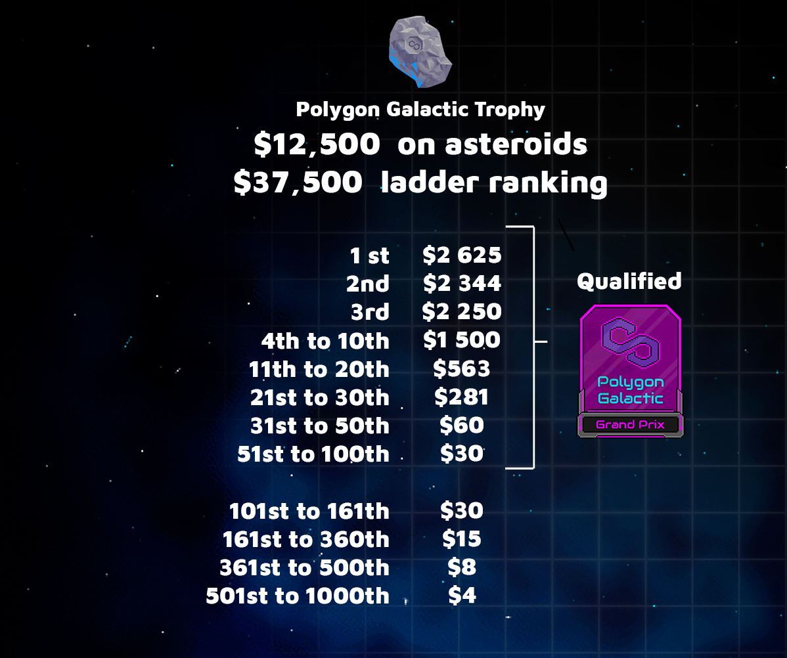

# Polygon Galactic Trophy Rules

### **Summary**

Reserved to common and uncommon Spaceships and below for 1,500 players competing for ~$50,000 in Polygon based tokens. The Top 100 players receive a ticket for the Grand Prix

### **Awards**

### **Date**

Saturday, the 17th of July, at 1pm UTC \(3pm CET, 6.30pm IST\).

### **Condition to participate**

1 Trophy Ticket + 1 Ship. Common \(Mule included\) and Uncommon Ship are accepted.

### **Duration**

About 2 hours.

### **Ranking determination**

To take into account the characteristics of the ships \(mining power\) The ranking is determined on the value of the mined tokens.  
****

**Mule Stats during the Trophy**

15km mining range   
100 mining power  
300s mining cooldown  
100 rover power  
****

### **End date for the Ranking**

A block number will be communicated before the tournament.  
The exact remaining time will be displayed by a counter in the game UI.  
****For comets, they remain minable until exhaustion.

### **Rover**

[Radioactive comets](https://medium.com/cometh/introducing-cometh-rovers-a-new-mining-mechanic-784fb924f412) will be present during the event

### **Trophy award date**

Reward and Tickets will be sent to the winner on Monday July 19

### **Further information**

Using a portal will burn your ticket, it’s a one way in 

Stadium will be accessible before the beginning of the tournament

Each cometh has différents rewards

You can participate with several ships, \(you need one ticket per ship\)

Items can be used at any time

A Snapshot will be taken precisely at the end of the count to freeze the leaderboard, it will be available soon after the end of the tournament

1 ticket per Dogg’O \(Uncommon Herd\) purchased from Tuesday July 13 12h UTC

