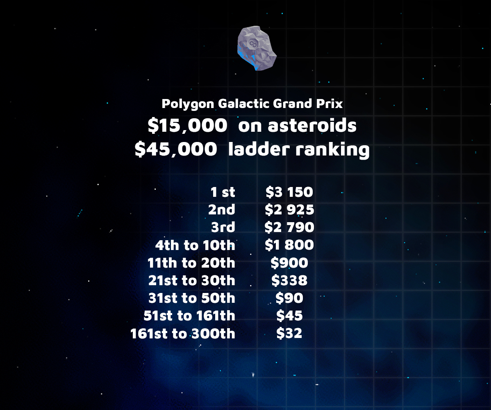

# Polygon Grand Prix Rules

### **Summary**

Reserved to Rare and Mythic Spaceships and below for **300** players competing for ~$60,000 in Polygon based tokens. 

### **Awards**

### **Date**

Sunday, the 25th of July, at 1pm UTC \(3pm CET, 6.30pm IST\).

### **Condition to participate**

1 Grand Prix Ticket + 1 Ship. Rare and Mythic Ship are accepted.

### **Duration**

About 2 hours.

### **Ranking determination**

To take into account the characteristics of the ships \(mining power\) The ranking is determined on the value of the mined tokens.  
****

**Mule Stats during the Grand Prix**

15km mining range   
100 mining power  
300s mining cooldown  
100 rover power  
****

### **End date for the Ranking**

A block number will be communicated before the tournament.  
The exact remaining time will be displayed by a counter in the game UI.  
****For comets, they remain minable until exhaustion.

### **Rover**

[Radioactive comets](https://medium.com/cometh/introducing-cometh-rovers-a-new-mining-mechanic-784fb924f412) will be present during the event

### **Trophy award date**

Reward will be sent to the winner on Monday July 26th

### **Further information**

Using a portal will burn your ticket, it’s a one way in 

Stadium will be accessible before the beginning of the tournament

Each cometh has différents rewards

You can participate with several ships, \(you need one ticket per ship\)

Items can be used at any time

A Snapshot will be taken precisely at the end of the count to freeze the leaderboard, it will be available soon after the end of the tournament

