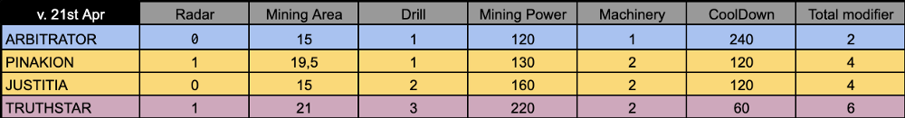
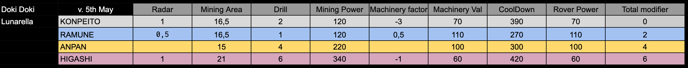
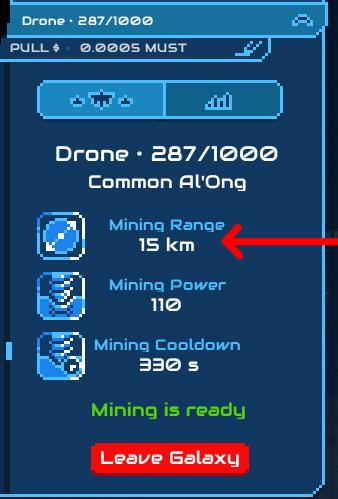
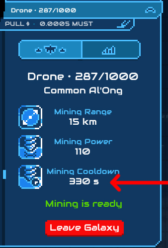

# Spaceship Characteristics

### **What are spaceships characteristics?** 

Spaceships' characteristics influence in-game behaviors and rewards.  
  
Spaceship characteristics can be found on the table bellow. Each ship has a Radar, Drill and Machinery, which respectively provide their respective characteristics, **Mining Area, Mining Power and Cooldown**:

> Base stats for common spaceships are 15 km range, 100% mining  power et 300 seconds cooldown.

Each perks points gives a bonus / malus depending on the rank on the spaceship

Common perks point: 1.5 km, 10%, 30 seconds each  
Uncommon perks point: 3 km, 20%, 60 seconds each  
Rare perks point: 4.5 km, 30%; 90 seconds each  
Mythic perks point: 6 km, 40%, 120 seconds each

* **Radar**: Provides the Mining Area.
* **Mining Area**: Area surrounding spaceship to mine.

* **Drill**: Provides Mining Power.
* **Mining Power**: Percentage of Mining rewards received by spaceships at each mining.

* **Machinery**: Provides the spaceships Cooldown.
* **Cooldown**: Timeframe triggered by a Mining during which the spaceship cannot mine.

As stated in [the whitepaper](https://www.cometh.io/cometh-white-paper.pdf), players will soon access perks of their spaceship: the engine, the drill tool and the aura. In the future, crew members will also play a role.

> “The engine of the spaceship can switch between different thrusters varying in colors and dragging the spaceships along the orbit slower or faster. The drill tools are spheres floating around the spaceship that have special effects on the mining such as guaranteed rewards when mining a specific token. The aura of the spaceship impacts the mining efficiency depending on the depletion of the asteroid and the distance to the asteroid.”

