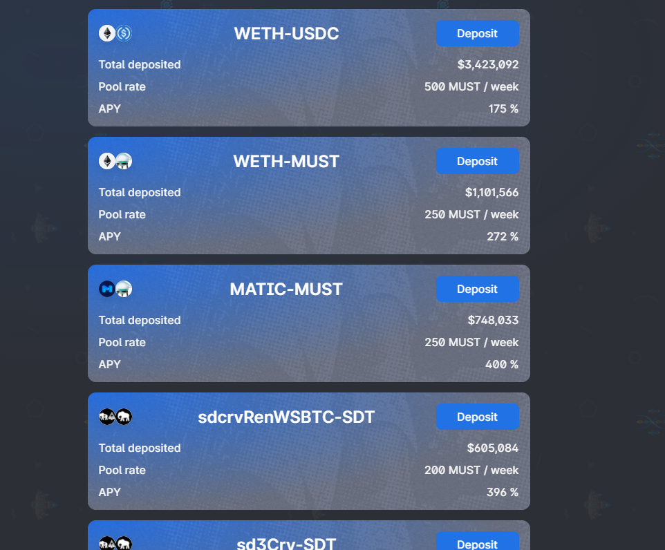
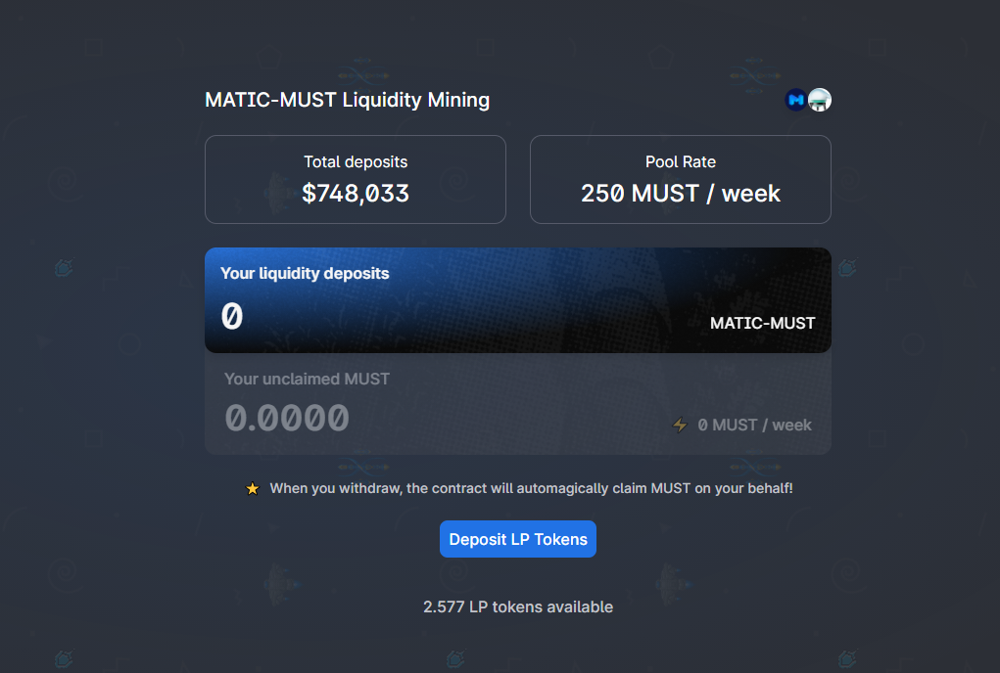
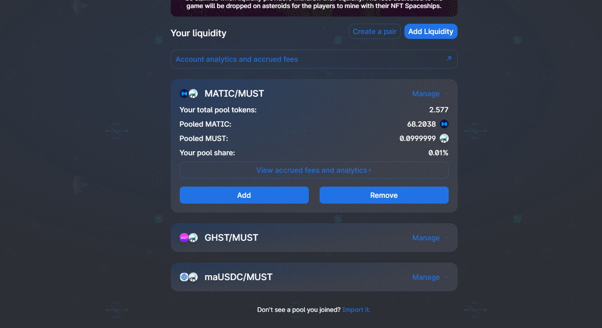
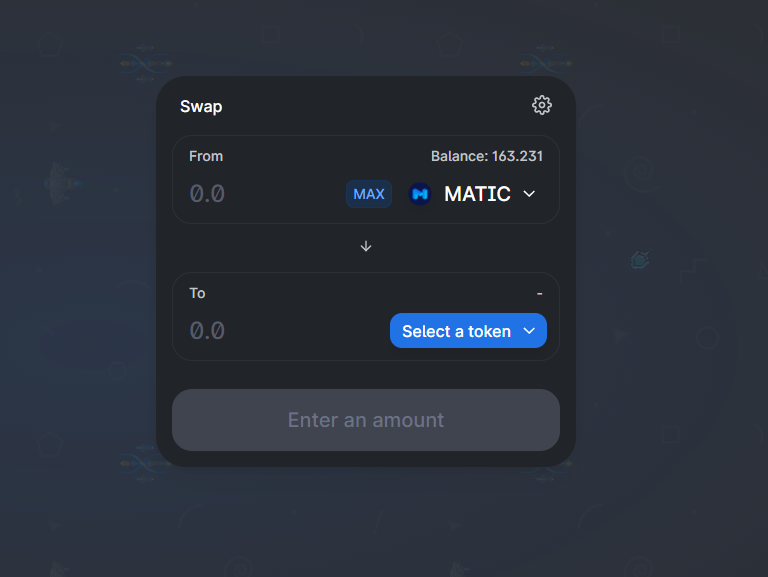

# Manage rewards in Comethswap

\_\_[Comethswap_](../comethswap-1/comethswap/) _is a L2 Decentralized Exchange (DEX) that will allow you to display and manage your Cometh rewards, as well as buying, selling and farming tokens._

## Manage Rewards on ****[**Comethswap**](https://swap.cometh.io/#/pool) ****

Head to [ComethSwap](https://swap.cometh.io/) to manage your rewards: 

You can manage your in-game rewards in different ways:

### Provide Liquidity

Become a liquidity provider directly with the [LP tokens](./) you get by playing the game!   
You just have to find the matching pool under the [farm](https://swap.cometh.io/#/stake) tab and deposit your LP tokens: 

By doing so, you will get a share of the weekly $MUST rewards allocated to the pools.  
By increasing your provided liquidity, you increase your weekly $MUST rewards. To learn more about the liquidity provider rewards take a look [here ](../comethswap-1/comethswap/).

### Remove liquidity

If you don't want to be liquidity provider on ComethSwap, you can also withdraw your LP tokens.  
To do so click on "manage" and "remove" in the Comethswap [Pool](https://swap.cometh.io/#/pool) section:

After the transaction, it will be transfered to your address and you will be able to [swap ](https://swap.cometh.io/#/swap)your tokens into any other cryptos:

### Withdraw tokens

Your rewards sit on Matic/Polygon's Layer2. You can withdraw tokens from there to Ethereum Mainnet via two ways:  
1. Use [https://bridge.cometh.io/](https://bridge.cometh.io/) to withdraw $MUST   
2. Use [https://wallet.matic.network/bridge/](https://wallet.matic.network/bridge/) to withdraw any token  
NB: Make sure you remove liquidity from pools before withdrawing tokens \(or you will not be able to do withdraw\)

