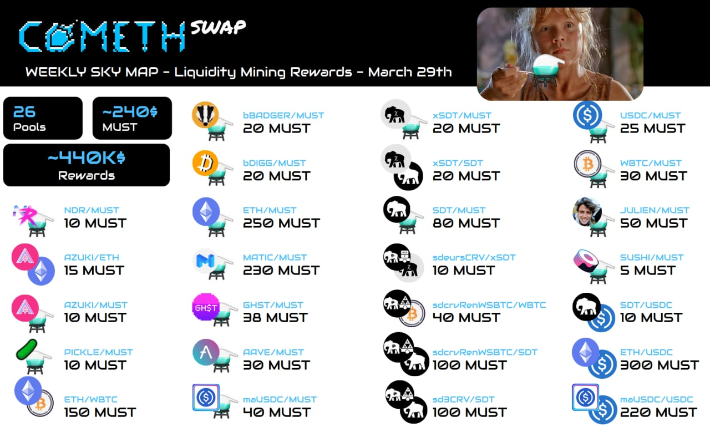

# Cometh rewards

## 1. Playing the game

### Mining rewards \(Active Income\)

Cometh is a Game, but not like most other games, it's base on a pay to earn model, also called the Play-to-earn model. It requires some initial investment \(spaceship purchase/renting\) but you will be able to earn substantial rewards by playing.  
  
Comets contain LP \(Liquidity Provider\) Tokens that can be withdrawn or stacked on [ComethSwap](https://swap.cometh.io/#/swap)  
Currently, you can find the following pairs in game :  
**- MUST / WETH :** 0x8826c072657983939c26e684edcfb0e4133f0b3d  
**- MUST / GHST :** 0x70640c8e29561f3704b1014e036baaa46640d0e2  
**- MUST / MATIC :** 0x80676b414a905de269d0ac593322af821b683b92

> Use the following adress to add the token your metamask \(click on add token\)  
> You can rename thoses token to match the Lp token names

> Remember to claim your reward here if you rent a ship : [https://rental.cometh.io/manage-rental](https://rental.cometh.io/manage-rental)

### Pulling fees \(Passive Income\)

Another way to earn tokens in the Cometh game is the **pulling mechanism**.  
When other players use your ships for a pull, you will get your pulling price in MUST ⚗️, minus 5% \(_the intergalactic toll fee_\).

> 0.0003 is the smallest pulling price currently accepted.  Cometh takes 5% fees on each pull for a minimum of 0.0003.  
> For example, if your pulling price is 0.006 MUST ⚗️ , Cometh will take 0.0003 MUST which corresponds to 5%. You will receive 0.0057 MUST ⚗️ .

This way, you are **generating passive incomes in MUST** ⚗️  ****when you are not playing the game

## 2. [ComethRental](../spaceships/comethrental/)

When you are not playing the game, you can use the rental system to maximize your profits from your spaceships !  
  
You can choose :  
- **Rental price** in MUST ⚗️   
- **Duration**   
- **Pulling rewards** share rate  
- **Mining reward** share rate  
  
Rewards are shared between Spaceship lenders and borrowers. It allows any player to earn rewards without initial investments.

See more about the renting System [here ](../spaceships/comethrental/)!  

## 3 Liquidity Mining on [ComethSwap](../comethswap-1/comethswap/)

[Comethswap](../comethswap-1/comethswap/) is an open Decentralized Exchange \(DEX\) where anyone can list an ERC20 compatible pair. In order to attract liquidity to ComethSwap, pools are being incentivised with token rewards.

The liquidity providers will be distributed MUST ⚗️ tokens without vesting.   
The pools and list of tokens available for trading at Comethswap is set to grow swiftly and steadily.

Find more info about ComethSwap [here ](../comethswap-1/comethswap/)!

